# Amazon Clone

> フル機能を備えたEコマースプラットフォーム

🔗 **デモ**: [https://amazon-clone-mocha-chi.vercel.app](https://amazon-clone-mocha-chi.vercel.app)

---

## 📖 概要

Amazonを参考にした、本格的なEコマースサイトです。商品検索・購入・決済・レビュー・レコメンド機能など、実際のECサイトに必要な機能を実装しています。

---

## 🏗️ システム構成

```mermaid
graph TB
    subgraph "Frontend"
        A[Next.js 14<br/>App Router]
        B[MUI Components]
        C[Zustand<br/>State Management]
    end

    subgraph "Backend"
        D[Express.js<br/>REST API]
        E[PostgreSQL<br/>Database]
    end

    subgraph "External Services"
        F[Firebase Auth<br/>認証]
        G[Stripe<br/>決済]
        H[Google Cloud Storage<br/>画像保存]
        I[Resend<br/>メール通知]
    end

    subgraph "Infrastructure"
        J[Docker<br/>開発環境]
        K[Vercel<br/>Frontend Deploy]
    end

    A -->|API Call| D
    A -->|Authentication| F
    A -->|Payment| G
    D -->|Query| E
    D -->|Upload| H
    D -->|Send Email| I
    D -->|Verify Token| F
    J -->|Container| D
    J -->|Container| E
    A -->|Deploy| K

    style A fill:#61dafb
    style D fill:#68a063
    style E fill:#336791
    style F fill:#ffca28
    style G fill:#635bff
    style H fill:#4285f4
    style I fill:#000000
    style J fill:#2496ed
    style K fill:#000000
```



---

## 🛠️ 使用技術

### Frontend
- **Next.js 14** (App Router, TypeScript)
- **Material-UI (MUI)** - UIコンポーネント
- **Zustand** - 状態管理
- **Firebase SDK** - 認証
- **Stripe.js** - 決済UI
- **Axios** - API通信

### Backend
- **Node.js + Express** (TypeScript)
- **PostgreSQL** - データベース
- **Firebase Admin SDK** - トークン検証
- **Stripe SDK** - 決済処理
- **Google Cloud Storage** - 画像保存
- **Resend** - メール送信

### Infrastructure
- **Docker & Docker Compose** - 開発環境
- **Vercel** - フロントエンドホスティング

---

## ✨ 主な機能

### 🛍️ ユーザー機能
- ✅ Firebase認証 (ログイン・登録)
- 🔍 商品検索 (キーワード・カテゴリ)
- 🎯 高度なフィルタリング (価格範囲、在庫状態)
- 📊 並び替え (価格・新着順・名前)
- 🛒 カート管理 (追加・削除・数量変更)
- 💳 Stripe決済統合
- 📦 注文履歴
- ⭐ 商品レビュー投稿・閲覧
- 🎯 レコメンドシステム
  - あなたへのおすすめ
  - よく閲覧する商品
  - 類似商品
  - 人気商品
- 📍 配送先住所管理

### 👨‍💼 管理者機能
- 📝 商品管理 (CRUD操作)
- 🖼️ 複数画像アップロード
- 📊 商品フィルタリング・ソート
- 📦 在庫管理

---

## 💡 工夫した点・技術的チャレンジ

### 1. パーソナライズされたレコメンドシステム
- ユーザーの閲覧履歴に基づくカテゴリベースのレコメンド
- 時間減衰アルゴリズム（最近の閲覧を重視）
- 商品の人気度とユーザーの興味を組み合わせたスコアリング

### 2. 無限スクロール実装
- Intersection Observer APIを使用したパフォーマンス最適化
- ページネーション状態管理
- フィルタ・ソート変更時の適切なリセット処理

### 3. 画像管理システム
- Google Cloud Storageへの複数画像アップロード
- メイン画像・サブ画像の管理
- 画像の並び替え機能

### 4. 決済フロー
- Stripe Checkout統合
- 在庫チェックと二重購入防止
- 決済完了後のメール通知（Resend）

### 5. 複雑な検索・フィルタリング
- 複数条件を組み合わせた動的SQL生成
- URLパラメータによる状態管理
- リアルタイムな価格範囲更新

### 6. TypeScript型安全性
- フロントエンド・バックエンド全体でTypeScript使用
- 厳密な型定義による開発効率向上

---

## 📂 プロジェクト構造

```
amazon-clone/
├── frontend/                 # Next.js フロントエンド
│   ├── src/
│   │   ├── app/             # App Routerページ
│   │   ├── components/      # Reactコンポーネント
│   │   ├── lib/             # API・ユーティリティ
│   │   ├── store/           # Zustand状態管理
│   │   └── types/           # TypeScript型定義
│   └── package.json
│
├── backend/                  # Express.js バックエンド
│   ├── src/
│   │   ├── controllers/     # リクエストハンドラ
│   │   ├── models/          # データモデル
│   │   ├── routes/          # APIルート
│   │   ├── services/        # ビジネスロジック
│   │   ├── middleware/      # 認証・バリデーション
│   │   └── config/          # 設定ファイル
│   └── package.json
│
├── docker-compose.yml        # Docker構成
└── README.md
```

---

## 📸 スクリーンショット

### ホーム画面
レコメンド商品、人気商品、新着商品を表示

### 商品検索画面
フィルタリング・ソート機能、無限スクロール

### 商品詳細画面
画像ギャラリー、レビュー表示、類似商品

### カート画面
商品の追加・削除・数量変更

### 管理者画面
商品管理、画像アップロード

---

## 🎯 今後の改善予定

- [ ] モバイル対応の強化
- [ ] 商品お気に入り機能
- [ ] リアルタイム在庫表示
- [ ] ユーザーレビューのいいね機能
- [ ] より高度なレコメンドアルゴリズム

---

## 📄 License

MIT License
