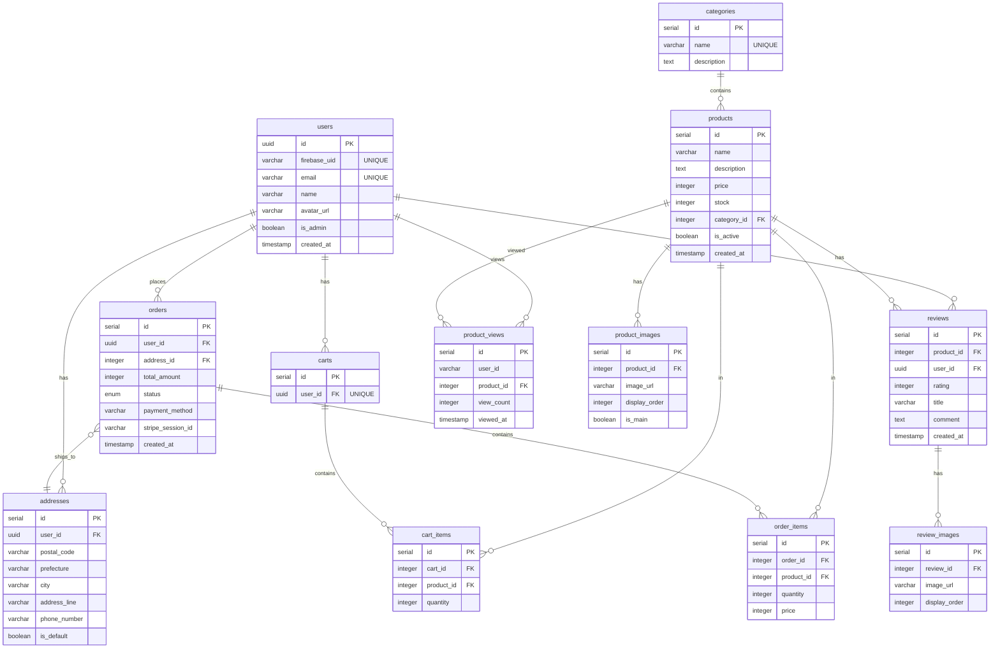

# Amazon Clone

> フル機能を備えた E コマースプラットフォーム

---

## 📺 デモ

<div align="center">


_実際のアプリケーションの動作デモ_

</div>

---

---

## 📖 概要

Amazon を参考にした、本格的な E コマースサイトです。商品検索・購入・決済・レビュー・レコメンド機能など、実際の EC サイトに必要な機能を実装しています。

---

## 🏗️ システム構成

```mermaid
graph TB
    subgraph "Frontend"
        A[Next.js 14<br/>App Router]
        B[MUI Components]
        C[Zustand<br/>State Management]
    end

    subgraph "Backend"
        D[Express.js<br/>REST API]
        E[PostgreSQL<br/>Database]
        F2[FastAPI<br/>Recommendation]
    end

    subgraph "External Services"
        F[Firebase Auth<br/>認証]
        G[Stripe<br/>決済]
        H[Google Cloud Storage<br/>画像保存]
        I[Resend<br/>メール通知]
    end

    subgraph "Infrastructure"
        J[Docker<br/>開発環境]
        K[Vercel<br/>Frontend Deploy]
    end

    A -->|API Call| D
    A -->|Authentication| F
    A -->|Payment| G
    D -->|Query| E
    D -->|ML Recommendation| F2
    D -->|Upload| H
    D -->|Send Email| I
    D -->|Verify Token| F
    F2 -->|Analytics| E
    J -->|Container| D
    J -->|Container| E
    J -->|Container| F2
    A -->|Deploy| K

    style A fill:#61dafb
    style D fill:#68a063
    style E fill:#336791
    style F2 fill:#009688
    style F fill:#ffca28
    style G fill:#635bff
    style H fill:#4285f4
    style I fill:#000000
    style J fill:#2496ed
    style K fill:#000000
```



---

## 🛠️ 使用技術

| カテゴリ           | 技術                           | 用途                       |
| ------------------ | ------------------------------ | -------------------------- |
| **Frontend**       | Next.js 14 (TypeScript)        | App Router、SSR/SSG        |
|                    | Material-UI (MUI)              | UI コンポーネント          |
|                    | Zustand                        | 状態管理                   |
|                    | Firebase SDK                   | 認証                       |
|                    | Stripe.js                      | 決済 UI                    |
|                    | Axios                          | API 通信                   |
| **Backend**        | Node.js + Express (TypeScript) | REST API                   |
|                    | FastAPI (Python)               | レコメンドエンジン         |
|                    | PostgreSQL                     | メインデータベース         |
|                    | Firebase Admin SDK             | トークン検証               |
|                    | Stripe SDK                     | 決済処理                   |
|                    | Google Cloud Storage           | 画像ストレージ             |
|                    | Resend                         | メール送信                 |
| **Infrastructure** | Docker + Docker Compose        | 開発環境                   |
|                    | Vercel                         | フロントエンドホスティング |

---

## 🗄️ データベース設計（ER 図）



---

## ✨ 主な機能

### 🛍️ ユーザー機能

- ✅ Firebase 認証 (ログイン・登録)
- 🔍 商品検索 (キーワード・カテゴリ)
- 🎯 高度なフィルタリング (価格範囲、在庫状態)
- 📊 並び替え (価格・新着順・名前)
- 🛒 カート管理 (追加・削除・数量変更)
- 💳 Stripe 決済統合
- 📦 注文履歴
- ⭐ 商品レビュー投稿・閲覧
- 🎯 レコメンドシステム
  - あなたへのおすすめ
  - よく閲覧する商品
  - 類似商品
  - 人気商品
- 📍 配送先住所管理

### 👨‍💼 管理者機能

- 📝 商品管理 (CRUD 操作)
- 🖼️ 複数画像アップロード
- 📊 商品フィルタリング・ソート
- 📦 在庫管理

---

## 💡 工夫した点・技術的チャレンジ

### 1. パーソナライズされたレコメンドシステム

- ユーザーの閲覧履歴に基づくカテゴリベースのレコメンド
- 時間減衰アルゴリズム（最近の閲覧を重視）
- 商品の人気度とユーザーの興味を組み合わせたスコアリング

### 2. 無限スクロール実装

- Intersection Observer API を使用したパフォーマンス最適化
- ページネーション状態管理
- フィルタ・ソート変更時の適切なリセット処理

### 3. 画像管理システム

- Google Cloud Storage への複数画像アップロード
- メイン画像・サブ画像の管理
- 画像の並び替え機能

### 4. 決済フロー

- Stripe Checkout 統合
- 在庫チェックと二重購入防止
- 決済完了後のメール通知（Resend）

### 5. 複雑な検索・フィルタリング

- 複数条件を組み合わせた動的 SQL 生成
- URL パラメータによる状態管理
- リアルタイムな価格範囲更新

### 6. TypeScript 型安全性

- フロントエンド・バックエンド全体で TypeScript 使用
- 厳密な型定義による開発効率向上

### 7. Seed データによる開発環境整備

- **カテゴリマスタ**: 10 カテゴリ（Electronics、Books、Clothing 等）
- **商品データ**: 各カテゴリ 50 件、合計 500 件の商品
- **テストユーザー**: 複数のユーザーアカウント
- **注文履歴**: ダミー注文データ
- **レビューデータ**: 商品レビューとレーティング
- **閲覧履歴**: レコメンドシステムテスト用データ

これにより、開発初期段階から実環境に近い状態でテスト可能

---

## 📂 プロジェクト構造

```
amazon-clone/
├── frontend/                 # Next.js フロントエンド
│   ├── src/
│   │   ├── app/             # App Routerページ
│   │   ├── components/      # Reactコンポーネント
│   │   ├── lib/             # API・ユーティリティ
│   │   ├── store/           # Zustand状態管理
│   │   └── types/           # TypeScript型定義
│   └── package.json
│
├── backend/                  # Express.js バックエンド
│   ├── src/
│   │   ├── controllers/     # リクエストハンドラ
│   │   ├── models/          # データモデル
│   │   ├── routes/          # APIルート
│   │   ├── services/        # ビジネスロジック
│   │   ├── middleware/      # 認証・バリデーション
│   │   └── config/          # 設定ファイル
│   └── package.json
│
├── docker-compose.yml        # Docker構成
└── README.md
```

---

## 📸 スクリーンショット

### ホーム画面

レコメンド商品、人気商品、新着商品を表示

### 商品検索画面

フィルタリング・ソート機能、無限スクロール

### 商品詳細画面

画像ギャラリー、レビュー表示、類似商品

### カート画面

商品の追加・削除・数量変更

### 管理者画面

商品管理、画像アップロード

---

## 🎯 今後の改善予定

- [ ] モバイル対応の強化
- [ ] 商品お気に入り機能
- [ ] リアルタイム在庫表示
- [ ] ユーザーレビューのいいね機能
- [ ] より高度なレコメンドアルゴリズム

---

## 📄 License

MIT License
